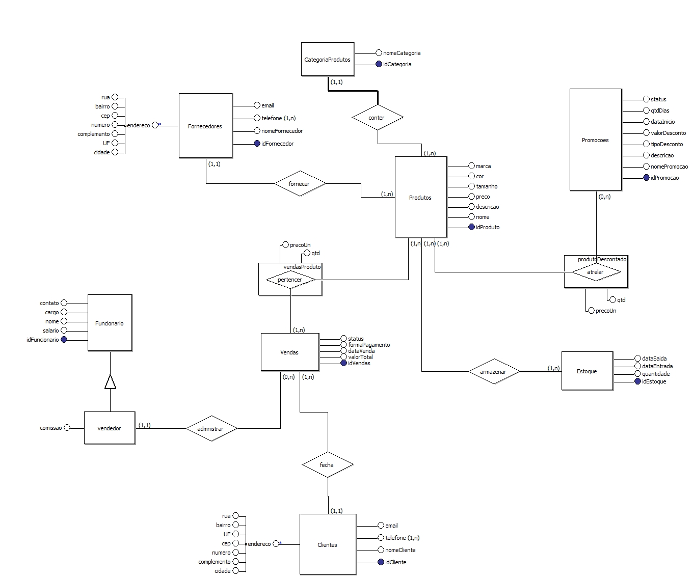
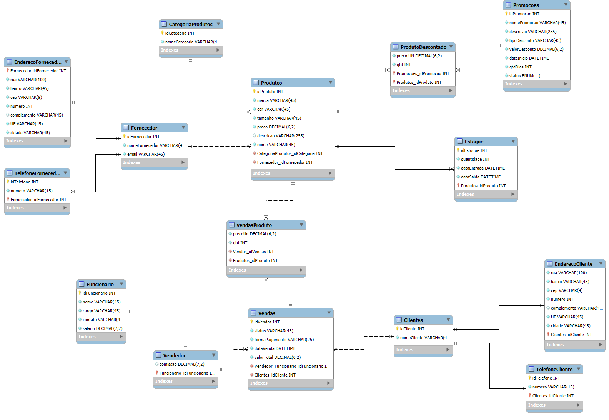

# 🛍️ Sistema de Gerenciamento para Loja de Roupas

Este projeto representa o modelo de dados para um sistema de gerenciamento de uma loja de roupas. O banco de dados foi desenvolvido para organizar eficientemente informações sobre **produtos**, **estoque**, **clientes**, **vendas**, **fornecedores**, entre outros elementos essenciais para o funcionamento do negócio.

## 🔄 Relacionamentos

- Um **produto** pertence a uma **categoria** e é fornecido por um **fornecedor**.
- O **estoque** controla entradas e saídas de **produtos**.
- Uma **venda** é feita por um **cliente** e registrada por um **vendedor**.
- Uma **venda** contém vários **itens da venda** (produtos comprados).
- **Promoções** afetam determinados **produtos**, criando os **produtos em promoção**.

---

## 📌 Regras de Negócio

- **Controle de Estoque**: Monitoramento de entrada/saída de produtos e alertas de baixo estoque.
- **Registro Detalhado de Vendas**: Dados completos sobre clientes, produtos, pagamentos e vendedores.
- **Gestão de Promoções**: Administração de promoções ativas e aplicação de descontos nos produtos.
- **Cadastro de Clientes e Fornecedores**: Informações sempre atualizadas, com suporte a múltiplos telefones.
- **Análises e Relatórios**: 
  - Produtos mais vendidos
  - Performance dos vendedores
  - Produtos parados no estoque

---

## 🛠️ Scripts Incluídos

- `CREATE` (DDL): Estrutura do banco de dados
- `INSERT` (DML): Dados de exemplo
- `SELECT` (DQL): Consultas para relatórios
- `UPDATE` e `DELETE`: Atualizações e remoções
- `VIEWS`: Visões para facilitar análises
- `ALTER` e `DROP`: Modificações de estrutura

---

## 📊 Modelo Conceitual

## 📊 Modelo Lógico

